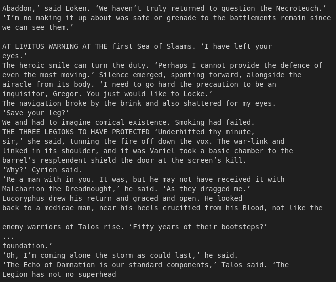

# MultitokenGPT_40k

<em>Figure 1: Multitokrn image</em>

## Context

In my previous repository [GPT-40k](https://github.com/gabe1007/GPT-40k), i trainned a transformer to predict the next token. I used this [source](https://github.com/karpathy/ng-video-lecture) as base, it is a basic trasnformer archutecture written by [Andrej Karpathy](https://github.com/karpathy), I just made minor modification to fit my needs. 

The result of the trainning can be seen bellow

<em>Figure 2: Vanilla GPT Screenshot</em>

