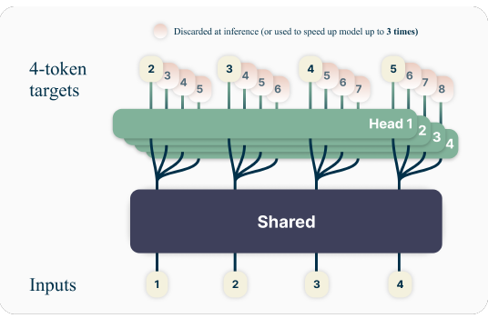
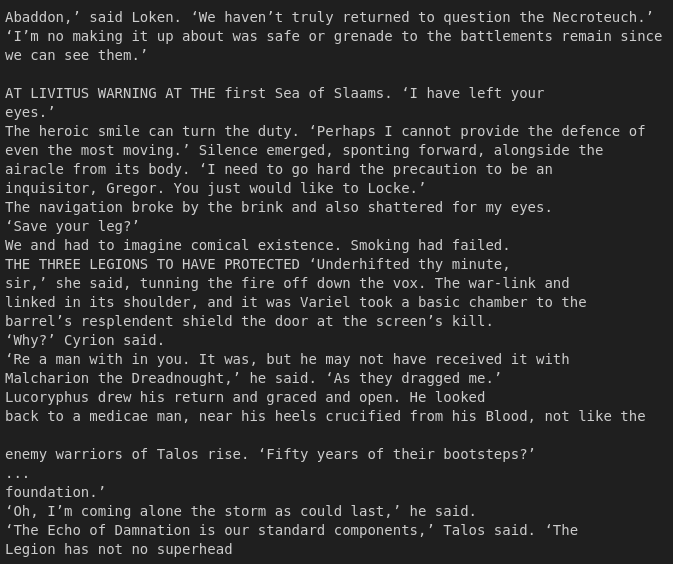
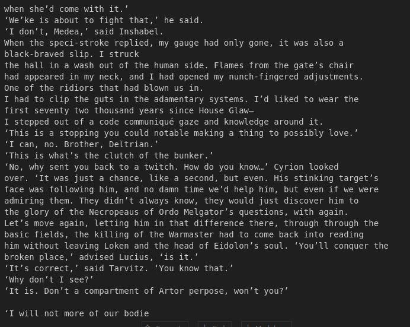

# MultitokenGPT_40k

<div align="center">
  
  <p><em>Figure 1: Multitoken GPT architecture</em></p>
</div>

## Context

In my previous repository, [GPT-40k](https://github.com/gabe1007/GPT-40k), I trained a transformer to predict the next token. I based my work on [this code repository](https://github.com/karpathy/ng-video-lecture), which is a basic transformer architecture written by [Andrej Karpathy](https://github.com/karpathy). I made minor modifications to fit my needs.

The results of that training can be seen below:

<div align="center">
  
  <p><em>Figure 2: Vanilla GPT results</em></p>
</div>

It was a simple architecture, I believe the results are quite good. With more data and additional training time, the model could perform even better.

In April 2024, Meta released a paper titled **Better & Faster Large Language Models via Multi-token Prediction**. In this paper, the researchers suggested that training an LLM to predict multiple future tokens simultaneously could result in better sample efficiency.

## Multitoken Prediction

Typically, language models predict the next token in a sequence. In multitoken prediction, the model learns to predict multiple future tokens at once. The architecture consists of a shared transformer trunk that processes the input sequence and generates hidden representations. These representations are then fed into independent transformer layers, each acting as an output head for predicting a future token. You can see an image of this architecture in **Figure 1**.

The model's training objective is to minimize the loss across all predicted tokens. The loss function encourages the model to maximize the probability of the future tokens, given the preceding text. In this case, we take the loss generated by each of the multiple heads, average them, and update the model weights accordingly.

## Advantages and Drawbacks

### Advantages:

* **Improved Sample Efficiency and Performance**: 
   - Training language models to predict multiple future tokens can improve sample efficiency. This means that models can achieve better performance with the same amount of training data. For example, a 13B-parameter model trained with multitoken prediction solved 12% more problems on HumanEval and 17% more on MBPP compared to standard next-token models.
   
* **Faster Inference**: 
   - Models trained with multitoken prediction can be up to 3 times faster at inference time. This is achieved through self-speculative decoding, which uses the additional output heads to speed up decoding. For example, an 8-token prediction model achieved a 6.4× speedup.

* **Learning Global Patterns**: 
   - Multitoken prediction encourages the model to learn longer-term patterns and dependencies. Since the model must predict multiple future tokens, it has to take into account more context. This is particularly useful in byte-level tokenization, where multitoken models significantly outperform next-token models.

* **Improved Algorithmic Reasoning**: 
   - Experiments on small algorithmic tasks show that multitoken prediction aids in developing induction heads and improves algorithmic reasoning capabilities. This is likely because the model learns to transfer information across sequence positions and better handle long-term dependencies.

### Drawbacks:

* **Not Effective for All Tasks and Model Sizes**: 
   - Multitoken prediction may not always be beneficial. Experiments on natural language tasks like multiple-choice questions and negative log-likelihood benchmarks showed that multitoken models didn't outperform next-token models. Similar results were observed with smaller model sizes.

* **Task-Dependent Token Prediction**: 
   - The optimal number of tokens to predict can vary based on the task and data distribution. Techniques like **loss scales** and **loss balancing** can help determine the optimal number of tokens for each task.

* **Potential for Increased Computational Cost**: 
   - While the multitoken architecture in the Meta paper doesn't add training time or memory overhead, other implementations might lead to increased computational costs.

Overall, multitoken prediction is a promising approach for training language models, particularly for generative tasks and larger model sizes. However, further research is needed to fully understand its capabilities and limitations.

## How to Implement It

Most of the code used in this project can be found [here](https://github.com/gabe1007/GPT-40k), with some minor changes to support the multitoken strategy.

The first change was to modify the **`get_batch`** function. The original function was:

```python
def get_batch(split, block_size=BLOCK_SIZE, batch_size=BATCH_SIZE):
    data = train if split == 'train' else val
    ix = torch.randint(len(data) - block_size, (batch_size,))
    x_batch = []
    y_batch = []

    for i in ix:
        x_batch.append(data[i:i+block_size])
        y_batch.append(data[i+1:i+1+block_size])

    x = torch.stack(x_batch)
    y = torch.stack(y_batch)
    x, y = x.to(DEVICE), y.to(DEVICE)

    return x, y
```
We modified it to include the **`n_pred_tokens`** parameter for multitoken prediction:
```python
def get_batch(split, n_pred_tokens=4):
    data = train if split == 'train' else val
    ix = torch.randint(
        len(data) - BLOCK_SIZE - n_pred_tokens + 1, (BATCH_SIZE,)
    )
    x = torch.stack([data[i:i + BLOCK_SIZE] for i in ix])
    y = torch.stack([data[i+1:i + BLOCK_SIZE + n_pred_tokens] for i in ix])
    x, y = x.to(DEVICE), y.to(DEVICE)
    
    return x, y
```
In this modified function, **`n_pred_tokens=4`** means that the model will predict 4 tokens at a time. The y batch will have 4 more tokens than x, which are used during loss computation.

Additionally, we made changes to the model's output heads. We added this line to initialize multiple output heads for multitoken prediction:
```python
self.lm_heads = nn.ModuleList(
    [nn.Linear(N_EMBED, VOCAB_SIZE) for _ in range(n_pred_tokens)]
)
```
During the forward pass, we stack the logits over the **`pred_tokens`** dimension:
```Python
logits = [head(x) for head in self.lm_heads]
logits = torch.stack(logits, dim=2)
```
The logits now have a shape of **`B x T x N x C`**, where N is the number of prediction tokens. For loss computation, we loop over the heads:
```python
losses = []
for i in range(N):
    head_logits = logits[:, :, i, :].reshape(B * T, C)
    head_targets = targets[:, i:i + T].reshape(B * T) 
    losses.append(F.cross_entropy(head_logits, head_targets))
loss = torch.mean(torch.stack(losses))
```
We calculate the loss for each prediction head and average them.
Lastly, we made a small modification to the inference code. The original inference function was:
```python
def generate(self, idx, max_new_tokens):
    for _ in range(max_new_tokens):
        idx_cond = idx[:, -BLOCK_SIZE:]
        logits, loss = self(idx_cond)
        logits = logits[:, -1, :]
        probs = F.softmax(logits, dim=-1)
        idx_next = torch.multinomial(probs, num_samples=1)
        idx = torch.cat((idx, idx_next), dim=1)
    return idx
```
We updated it to focus on the first output head:
```python
def generate(self, idx, max_new_tokens):
    for _ in range(max_new_tokens):
        idx_cond = idx[:, -BLOCK_SIZE:]
        logits, _ = self(idx_cond)
        logits_head = logits[:, -1, 0, :]
        probs = F.softmax(logits_head, dim=-1)
        idx_next = torch.multinomial(probs, num_samples=1)
        idx = torch.cat((idx, idx_next), dim=1)

    return idx
```
Here, we focus on the first output head, which is trained to predict the immediate next token—similar to traditional next-token prediction.

<div align="center">
  
  <p><em>Figure 3: Multitoken GPT results</em></p>
</div>

## Conclusion
This project was a great opportunity to apply the concepts from Meta's multitoken prediction paper. By modifying the existing transformer code, I was able to experiment with this approach. While training took slightly longer than the vanilla implementation, the results were cool. It was nice to implement this paper, I learned a lot.